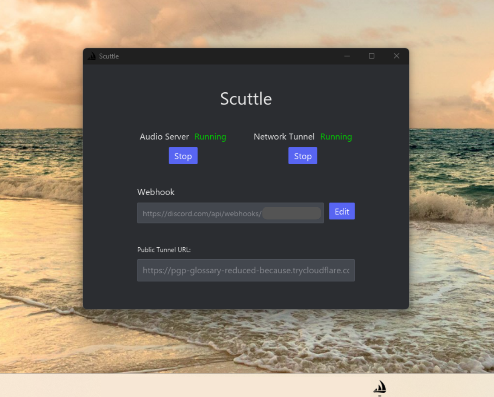

---

Scuttle is an audio archival tool for managing and playing your personal audio collection. Self-host your audio library from your laptop and stream to any device with a browser. For installation see [Quick Start](#quick-start).

---

<table>
    <tr>
        <td align="center" width="60%">
            <p><b>Desktop Launcher</b> <em>(5/11/26)</em></p>
            </img>
        </td>
        <td align="center" width="40%">
            <p><b>Web Client</b> <em>(5/11/26)</em></p>
            <video src="https://github.com/user-attachments/assets/c76482a3-96f5-4ffb-94b7-9fa0437f97e1" controls muted loop style="max-width: 100%;"></video>
        </td>
    </tr>
</table>

*(Additional screenshots and links to video demos with date)*


---

# Features

### Completely free

The only cost is electricity for self-hosting, and the resources for your computer to handle serving audio files.


---

### Downloading

* **Safety:** Currently, downloading is exclusively done with [yt-dlp](https://github.com/yt-dlp/yt-dlp), and the only supported source is YouTube.

* **Reliability:** Scuttle uses the nightly version of `yt-dlp`. On download failures, automatically performs self-healing nightly version updates to the most recently available version, and then re-tries the download.

* **QOL:** Some important under the hood explanations of quality-of-life download logic that may not be apparent:
    
    * Audio from YouTube is downloaded on the first result that is found from the top 3 search results, but if a target duration is available,finds the closest track duration (to reduce cases of downloading MVs with extra unwanted audio, or versions with intros/outros).
    
    * Metadata from a YouTube download is overwritten if provided from an alternate platform's native link, otherwise a small <2 MB AI model attempts to extract and set metadata. Source code can be found on [this notebook](https://colab.research.google.com/drive/1MHd5qqSNmc9Of4HgElKvbQd45IZZ9-3I?usp=sharing).


---

### Audio quality and compatibilty

* Audio files have a target of `192kbps` in `m4a` format for maximum device compatibility. For reference, about 3:30 of audio is around 5MB at this quality level.

* Web client streams audio with mobile device screens powered off (even on iOS devices).

* Leading and trailing silence is stripped for the purpose of optimizing file size and listening consistency.

* To eliminate volume disparity audio loudness is explicitly calibrated to **-16 LUFS** which follows [AES recommendations](https://www.radioworld.com/tech-and-gear/tech-tips/streaming-audio-loudness-guidelines-explained) for internet audio tracking.


---

### Integrated orchestration

* A native desktop launcher handles the lifecycle of your server, including accessibility via a Discord webhook, and manages uptime of a Cloudflared tunnel to ensure maximum availability. 

    **At the cost of being free, this could mean sudden rotations of user-accessible links to the web-client if the tunnel breaks.**

* On setup, installs all required software prerequisites and maintains updates of frequently updating critical packages. See [dependencies](#important-external-dependency-disclaimer) here.

* It is recommended to change computer settings so that it stays on even with the screen off when connected to power, to ensure server uptime. This will be in effect until an anti-sleep battery-aware solution is implemented into the desktop launcher.


---

### Better queue functionality

* Swipe to queue a song to the front **or** the back of the queue.

* Swipe on playlists (just like you would a track) to play them directly. 

* Due to unavoidable download and processing time, first download/plays are immediately sent to the front of the queue when available and are **not** instantly streamable.


---

### Import playlists

Use native site share links to import playlists and tracks from other sources. Paste links directly into the search bar and press `Enter` to begin downloading playlists or tracks. 

Single track links are treated like regular searches and are pushed to the front of the play queue when available, while playlists are automatically pushed to the back of the queue as they populate for an ordered listening experience.

**Currently supported sites:**

* YouTube
* Spotify


---

### Listening stats

* Track your own statistics. Your listening data doesn't go anywhere and is stored exlusively on your own device.

* Currently only a few statistics are tracked and viewable from the web client user interface:

    * Scuttle start date
    * Total listened duration
    * Total audio storage usage


---

# Quick Start

1. Go to Scuttle's [Latest Releases](https://github.com/whimsypingu/scuttle-it/releases/latest) page.

2. Download the `.zip` file for your OS (currently only Windows is supported).

3. Unzip the project into your filesystem.

4. Run the `scuttle` executable, and follow steps to initialize the environment and start the audio server. Installation may take a while.


### Requirements:
Ensure you have `python` installed on your device. (You can test this by typing `python --version` into a terminal).

### Important external dependency disclaimer:
The default Scuttle setup downloads some external binaries during installation. Here is a brief explanation of them:

* **ffmpeg/ffprobe** - Extracting and modifying audio files.

* **deno** - JavaScript runtime engine to safely execute web scraper scripts (recommended for reliable yt-dlp usage).

* **cloudflared** - Establishes free connection tunnel from your machine to the Cloudflare network, allowing you to access your Scuttle server from the internet without having to configure anything on your router.

For other dependencies that will require an internet connection to set up, see the [requirements.txt](./apps/audio-server/requirements.txt) file for the audio server.


---

## Project Structure
The project is organized as a monorepo to separate the concerns of data management and user interface. Each main component is found inside the `apps/` folder.

```bash
scuttle-it/
├── apps/
│   ├── audio-server/           # SQLite + FastAPI backend (Python)
│   ├── desktop-launcher/       # iced orchestrator (Rust)
│   └── web-client/             # React + vite frontend (TS)
├── .gitattributes
├── .gitignore
└── workspace.json
```

---

### AI Disclosure
Parts of this codebase were developed with the assistance of Google Gemini and OpenAI ChatGPT free versions. All generated code in the existing main codebase has been manually reviewed.

## License
Distributed under the MIT [License](./LICENSE).

*Created and maintained by whimsypingu.*

## Disclaimer
Scuttle is provided for personal and non-commercial use only.
The developer does not endorse, support, or encourage downloading copyrighted material without permission. You are solely responsible for complying with all applicable laws and the terms of service of any platforms you interact with. This project is intended to help users archive, manage, and listen to their own legally obtained audio collections. The developer is not responsible for any misuse of this software.
